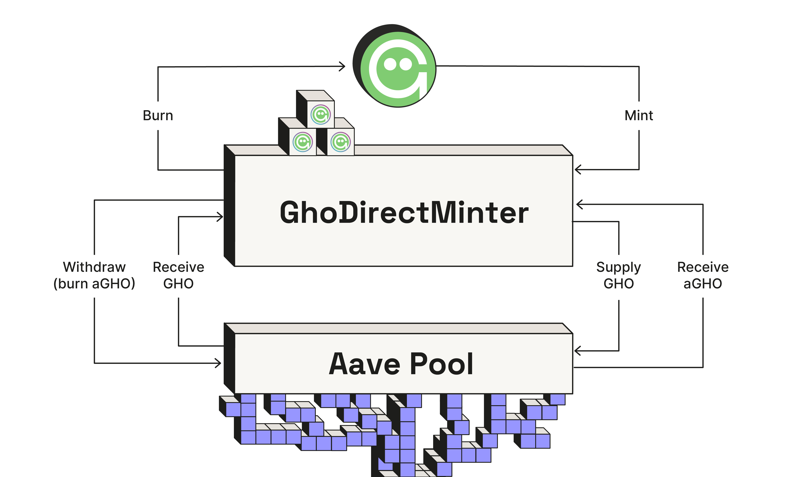

## GhoDirectMinter



The GHO direct minter is a generic facilitator that can inject GHO into an aave pool.

### Summary

The `GhoDirectMinter` is a smart contract that can be used to mint & burn GHO directly into/from an Aave pool.
In order to mint GHO the `GhoDirectMinter` will need to be registered as a `Facilitator` in the GHO contract.

This repository contains two contracts:

- [`GhoDirectMinter`](./src/GhoDirectMinter.sol) which contains the actual Facilitator
- [`LidoGHOListing`](./src/proposals/LidoGHOListing.sol) which is a reference implementation of a proposal to 1) list GHO on Aave Lido instance and 2) deploy and active a `GhoDirectMinter` facilitator.

### Specification

**Prerequisites:**

- the pool targeted by the `GhoDirectMinter` must have GHO listed as a reserve.
- the GHO AToken and VariableDebtToken implementations must not deviate from the Aave standard implementation.
- the `GhoDirectMinter` must be registered as a `Facilitator` with a non zero bucket capacity.
- the `GhoDirectMinter` must obtain the `RISK_ADMIN_ROLE` in order to supply GHO to the pool.

The `GhoDirectMinter` offers the following functions:

- `mintAndSupply` which allows a permissioned entity to mint GHO and supply it to the pool.
- `withdrawAndBurn` which allows a permissioned entity to withdraw GHO from the pool and burn it.
- `transferExcessToTreasury` which allows the permissionless transfer of the accrued fee to the collector.

While default permissioned entity is the owner(likely the governance short executor), but the contract inherits from [UpgradeableOwnableWithGuardian](https://github.com/bgd-labs/solidity-utils/blob/main/src/contracts/access-control/UpgradeableOwnableWithGuardian.sol) which allows to share permissions with another party (e.g. the GHO stewards).

### Risk considerations

The `GhoDirectMinter` can only inject and remove available GHO from the pool.
The actual maximum exposure of the reserve is managed via the `BucketSize` and the chosen `borrow cap`.

## Development

This project uses [Foundry](https://getfoundry.sh). See the [book](https://book.getfoundry.sh/getting-started/installation.html) for detailed instructions on how to install and use Foundry.

## Setup

```sh
forge install
```

## Test

```sh
forge test
```
