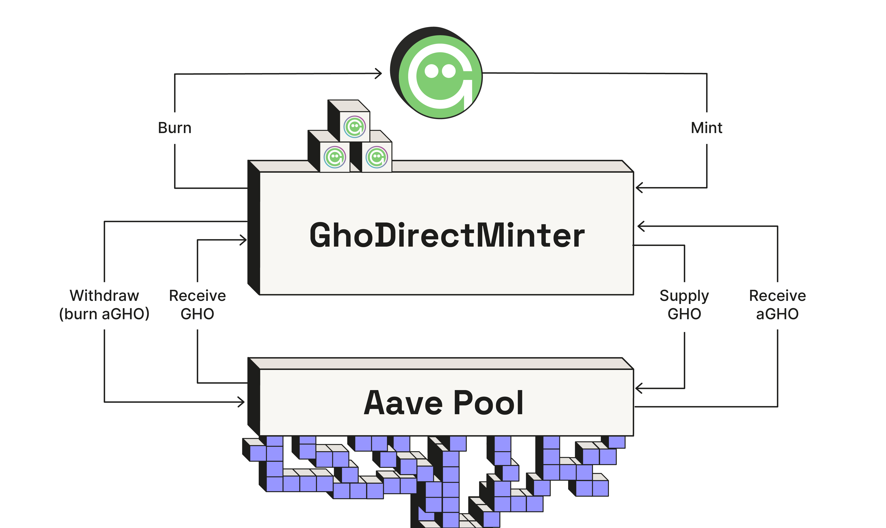

## GhoDirectMinter



The GHO direct minter is a generic facilitator that can inject GHO into an Aave pool.

### Summary

The `GhoDirectMinter` is a smart contract that can be used to mint & burn GHO directly into/from an Aave pool.
In order to mint GHO the `GhoDirectMinter` will need to be registered as a `Facilitator` in the GHO contract.

This repository contains the following contracts:

- [`GhoDirectMinter`](./src/GhoDirectMinter.sol) — Facilitator for Aave v3 pools.
- [`GhoDirectMinterV4`](./src/GhoDirectMinterV4.sol) — Facilitator for the Aave v4 Hub.

---

### GhoDirectMinter (v3)

**Prerequisites:**

- the pool targeted by the `GhoDirectMinter` must have GHO listed as a reserve.
- the GHO AToken and VariableDebtToken implementations must not deviate from the Aave standard implementation.
- the `GhoDirectMinter` must be registered as a `Facilitator` with a non zero bucket capacity.
- the `GhoDirectMinter` must obtain the `RISK_ADMIN_ROLE` in order to supply GHO to the pool.

The `GhoDirectMinter` offers the following functions:

- `mintAndSupply` which allows a permissioned entity to mint GHO and supply it to the pool.
- `withdrawAndBurn` which allows a permissioned entity to withdraw GHO from the pool and burn it.
- `transferExcessToTreasury` which allows the permissionless transfer of the accrued fee to the collector.

While default permissioned entity is the owner (likely the governance short executor), the contract inherits from [UpgradeableOwnableWithGuardian](https://github.com/bgd-labs/solidity-utils/blob/main/src/contracts/access-control/UpgradeableOwnableWithGuardian.sol) which allows to share permissions with another party (e.g. the GHO stewards).

**Risk considerations:**

The `GhoDirectMinter` can only inject and remove available GHO from the pool.
The actual maximum exposure of the reserve is managed via the `BucketSize` and the chosen `borrow cap`.

---

### GhoDirectMinterV4

The `GhoDirectMinterV4` is the Aave v4 equivalent. Instead of interacting with an Aave v3 Pool, it injects GHO as liquidity into an Aave v4 Hub.

**Prerequisites:**

- GHO must be registered as an asset on the Hub.
- the `GhoDirectMinterV4` must be registered as a **spoke** on the Hub for the GHO asset with `addCap` set to `MAX_ALLOWED_SPOKE_CAP` and `drawCap` set to `0`.
- the `GhoDirectMinterV4` must be registered as a GHO `Facilitator` with a non-zero bucket capacity.
- the Hub's `AccessManager` must grant `HUB_ADMIN_ROLE` to the entity that will call `addSpoke` (e.g. the governance executor).

The `GhoDirectMinterV4` offers the following functions:

- `mintAndSupply` — mints GHO directly to the Hub and calls `hub.add()` to register the added liquidity.
- `withdrawAndBurn` — calls `hub.remove()` to withdraw GHO and then burns it.
- `transferExcessToTreasury` — computes the excess shares (spoke balance above the facilitator bucket level) and transfers them to the Hub's fee receiver via `hub.payFeeShares()`.

**Caveats:**

- The Hub uses a share-based accounting model. Share-to-asset conversions may introduce small rounding differences (typically ±1 wei). The `transferExcessToTreasury` function underestimates excess shares to ensure the facilitator always remains at or above its bucket level.
- The constructor derives `ASSET_ID` from `hub.getAssetId(gho)`, so GHO must already be registered on the Hub at deployment time.

**Risk considerations:**

The `GhoDirectMinterV4` can only inject and remove available GHO from the Hub.
The actual maximum exposure is managed via the GHO `BucketSize`, the spoke's `addCap`, and Hub-level parameters.

## Development

This project uses [Foundry](https://getfoundry.sh). See the [book](https://book.getfoundry.sh/getting-started/installation.html) for detailed instructions on how to install and use Foundry.

## Setup

```sh
forge install
```

## Test

```sh
forge test
```
